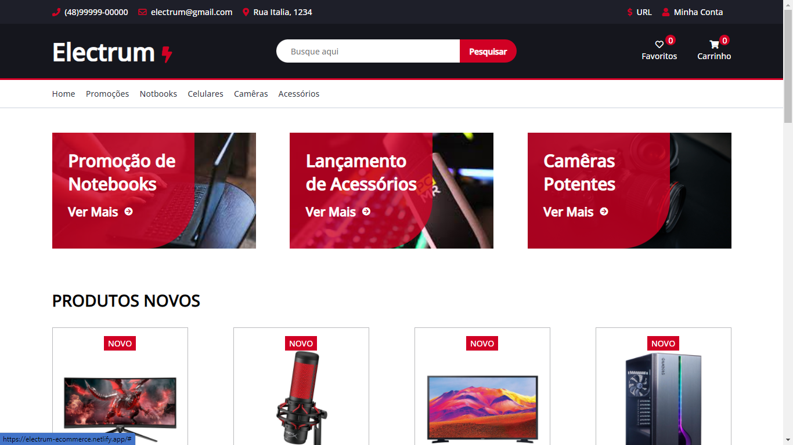

### Electrum E-Commerce

> Projeto do curso <strong>"SASS e SCSS do básico ao avançado + Projetos"
> Responsivo  
## Acesse o site<a href="https://electrum-ecommerce.netlify.app/" target="_blank"> clique aqui</a>!

